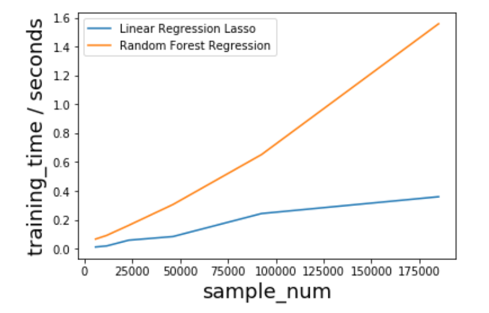
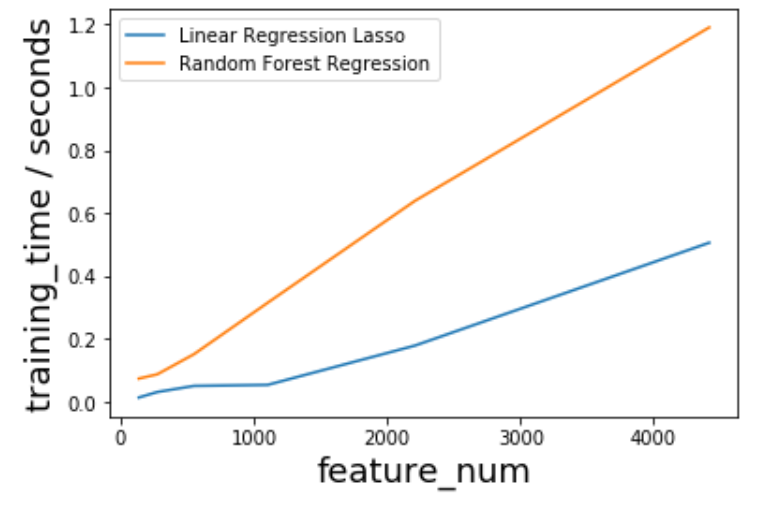
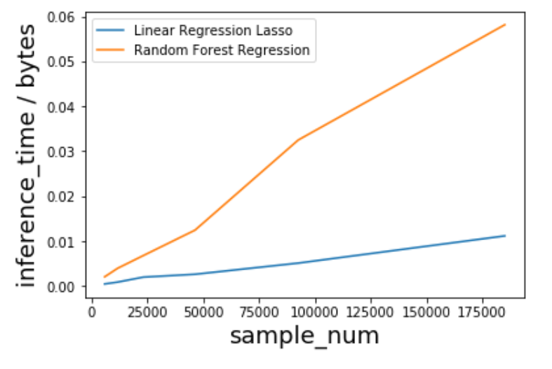
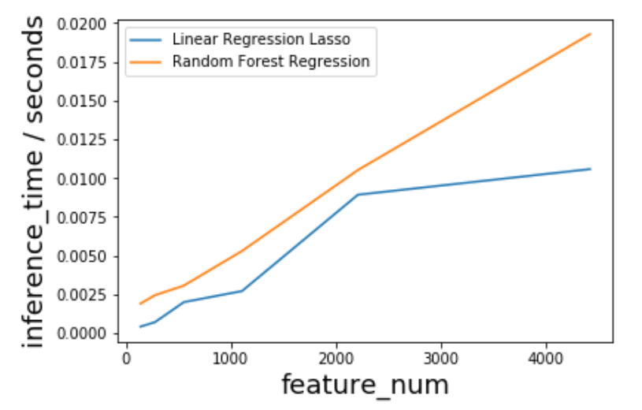
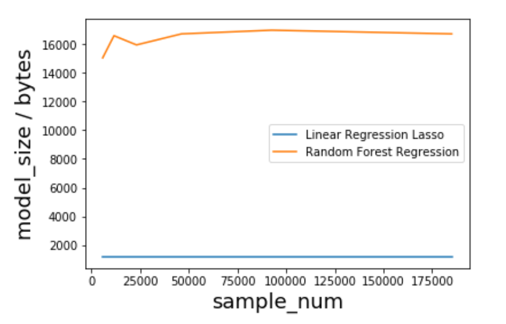
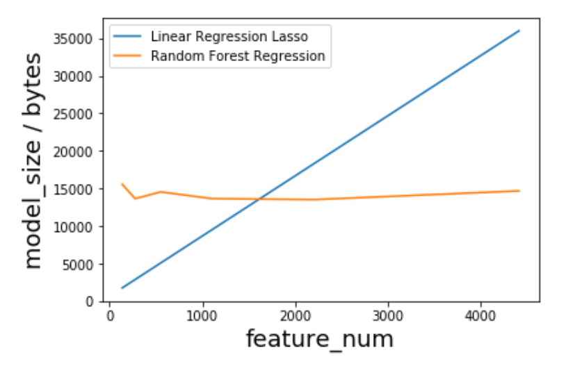

# Group Assignment 2: AI Tradeoffs

Chenxi Li, Kartik Moudgil, Yuchen Wang, Zhouyi Yang

## Techniques

1. Linear Regression: Lasso
2. Random forest

Both models are implemented and tested in a [jupyter notebook](https://github.com/Zhouyiy/17645GroupProjectTeamA/blob/master/movieRecommend/model/movie-popularity/ModelComparison-Lasso_RF.ipynb) in our GitHub repo using [scikit-learn](https://scikit-learn.org/stable/) library.

## Problem

The primary scenario we are analyzing here is how to predict movie popularity. The dataset we are using here is derived from G1, and we list the features here again.

- runtime
- vote_average
- vote_count
- adult
- original_language(One-hot)
- genres(One-hot)

And we are trying to use regression methods to predict what the `popularity` is. All the columns are standardized.

## Measurement

The measurements that we are considering here are as follows:

- Accuracy
  - This is measured by the cross-validation mean squared error of both models.
- Training time & Inference time
  - We train and test the model using different sizes of input data, and we write a for loop to make the difference of training and testing time more obvious. This will be discussed in more detail later.
- Model size
  - We compare the sizes of the models after using `pickle` to dump onto the disk.
- Interpretability
- Linear / non-linear

### Accuracy

We split the data into a train-test split of 70%:30%. On training data, we performed a grid search of the optimal hyper-parameters of two models(`alpha` for Lasso, `max_depth` and `n_estimators` for random forest). And we use the mean-squared-error(MSE) as our criterion. It turns out that the MSE of Lasso is 0.496426, and the one for random forest is 0.283986. In this sense, the random forest actually achieve a better accuracy on predicting the popularity.

### Training time & Inference time

We compare the training time and inference time of two models when the sample size or the feature size gets really big.

#### Training time VS sample_num / feature_num

We can see that it takes more time for random forest to train over large dataset compared to linear regression. And the difference gets bigger and bigger when we have larger and larger dataset.

#### Inference time VS sample_num / feature_num

Again, it takes more time for random forest to infer compared to linear regression. We suspect that it is because linear regression can utilize linear algebra to do fast matrix computation and get the result of training and inference, while random forest may not be optimized in this way.

### Model size

This result is not surprising. The sizes of these models do not rely on the number of samples we have in our dataset.

Intuitively, we have larger linear regression model when we have more features, because we have a one-one relationship between the features and the parameters. However, for random forest, the size of the model mainly depends on `max_depth` and `n_estimators`. In this case, since we are testing the model size using fixed hyper-parameters for both models, the size of the random forest model remains the same no matter how many features we have.

### Interpretibility

Both of these models have good interpretibility. However, we argue that linear regression has an even better interpretibility compared to random forest. First, for low-dimension data, linear regression can be used to produce intuitive visualizations by scattering the data points and drawing a line. This really helps stakeholders who do not have much machine learning background to easily grasp the meaning. Second, each parameter in linear regression has a very clear relationship with one of the features. You can even tell how much popularity increase or decrease you can expect if you tune one of the movie features. Third, if you have a large random forest with deep trees, the interpretibility of this model may decrease a lot compared to a single decision tree.

### Linear / Non-Linear

The linear regression can only capture linear relationship in the data if you do not use tricks like polynomial terms. However, for a random forest, it has the ability to detect the non-linear relationship in the data.

## Recommendation

|                           | Accuracy | Training / Inference Time | Model Size | Interpretibility | Linear / Non-Linear |
| ------------------------- | -------- | ------------------------- | ---------- | ---------------- | ------------------- |
| Linear Regression (Lasso) |          | √                         | √          | √                |                     |
| Random Forest             | √        |                           | √          |                  | √                   |

The table above summarizes the comparisons we have done so far. In our primary scenario, we try to predict the popularity of a movie. In this kind of problems, the accuracy has a high priority. 

In our experiments, the training and inference time of random forest is longer compared to the time taken by a linear regression model. However, we have to note that: the training and inference time may not necessarily require on-the-fly speed of response. It can be done in the back-end once in a while. And also, while random forest may not be optimized using linear algebra, this model can naturally be parallelized across machines to do training and inference. So the training and inference time may vary depending on how much optimization has been done. 

The model size of the models depend on different things: one is number of features in data, another is hyper-parameters. In this sense, it is hard to compare the model size under the same criterion. It depends on the dimension of the data and the best hyper-parameters we can find on that data. However, we are almost certain that they should both take less space than a neural network.

The interpretibility and linear / non-linear are the properties of the models themselves. It should be a guideline of what model to choose after we have the problem. However, they may not be very important except for certain scenarios: for example, the clients want you to persuade them that there is a pattern in this dataset. In this case, you may want to use a model with higher interpretibility so that you can easily explain the model to the clients. However, in our main scenario, the accuracy is more important. 

In summary, we recommend using random forest in our main scenario.