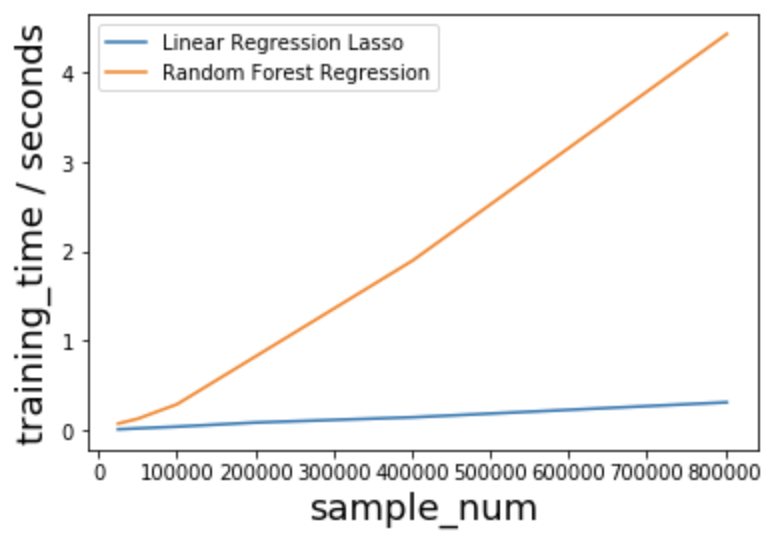
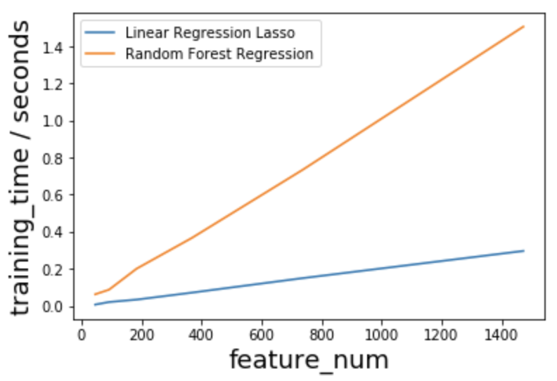
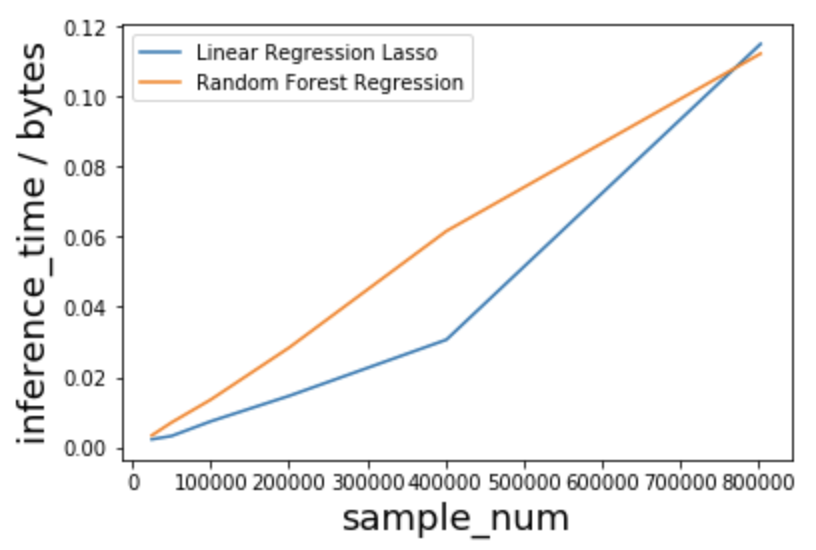
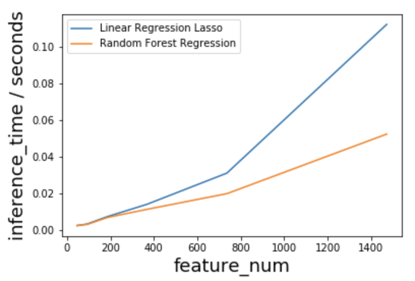
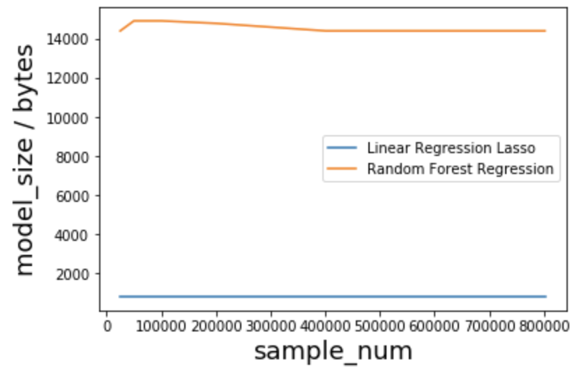
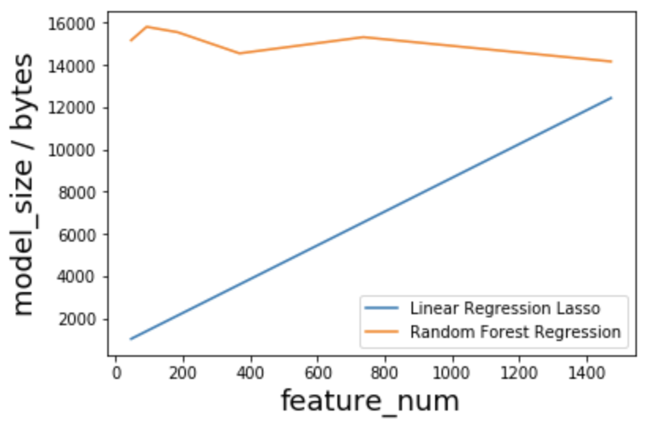

# Group Assignment 2: AI Tradeoffs

Chenxi Li, Kartik Moudgil, Yuchen Wang, Zhouyi Yang

## Techniques

1. Linear Regression: Lasso
2. Random forest

Both models are implemented and tested in a [jupyter notebook](https://github.com/Zhouyiy/17645GroupProjectTeamA/blob/master/movieRecommend/model/rate-prediction/alternative_scenario.ipynb) in our GitHub repo using [scikit-learn](https://scikit-learn.org/stable/) library.

## Problem

In the primary scenario, we recommended the random forest. Now we explore an alternative scenario where we recommend the linear regression as being more suitable.
Generally speaking, linear regression model often serves as a starting point because of its low training cost, low inference time, and small model size. Considering its special attributes and constraints, the scenario can be inspired by the following criteria:
1. Whether there is a natural linear relationship between independent variables and dependent variable in this problem.
2. Whether the application scenario requires a light-scale, quick-to-run, frequently-trained model.
3. Whether the output of the regression model should be a numerical / continuous value.

Based on the these criteria, the alternative scenario we are analyzing here is to predict users' preference to a specific movie genre (measured by rate scores) by age, gender, and their rating scores for movies in certain genres. So the dependent variable here is rate scores, which is a numerical / continuous value. And the independent variables are users' age, gender, as well as the genres of the movie they rated.

We assumed that the higher rating score a user gave to a movie, the more likely it is that this user would want to watch more movies in the same genres. And we assumed that user in certain age group with certain gender would more likely to watch certain types of movies. So we choose these features as training input.

As the user is continuously watching new movies, the model should be trained frequently to recommend latest users' favorite movie genres, which prefers models with low training cost. As user would like to see the recommendation result right after they visit the website (or mobile app), the inference time of the model should be almost instantaneous. Furthermore, due to data privacy issues, users may not want to upload their age or gender information to the server, which means the model may not be deployed on an external server or the cloud. It might be more appropriate to deploy the model in the users' local device, which prefers light-scale, small size model. To sum up, this scenario prefers model with lower training cost, lower inference time, and smaller size.

To prove that the linear regression model is the better choice, the criteria should be considered when doing tradeoffs are attributes and constraints.

## Attributes
### Design attributes

#### Accuracy
We split the data into a train-test split of 70%:30%. On training data, we performed a grid search for the optimal hyper-parameters of two models(`alpha` for Lasso, `max_depth` and `n_estimators` for random forest). And we use the mean-squared-error(MSE) as our criterion to compare the two models. It turns out that the MSE of Lasso is 0.533825, and the one for random forest is 0.533390. In this sense, the linear regression model achieve almost the same accuracy as random forest do on predicting the popularity.

#### Training Time

We can see that it takes more time for random forest to train over large dataset compared to linear regression. And the difference gets bigger and bigger when we have larger and larger dataset, as would happen for a typical user's history.

#### Inference Time

Again, it takes more time for random forest to infer compared to linear regression. Only when the number of sample reaches 750000 will the linear regression takes more time to infer. We suspect that it is because linear regression can utilize linear algebra to do fast matrix computation and get the result of training and inference, while random forest may not be optimized in this way.

#### Memory usage (model size)

The sizes of these models do not rely on the number of samples we have in our dataset. Only when the number of feature reaches around 1500 will the model size of the linear regression possibly exceed the size of the random forest model; which is very unlikely in this situation. So generally the size of the linear regression model is much smaller than the size of the random forest model.

## interpretability

Both of these models have good interpretability. However, we argue that linear regression has better interpretability compared to random forest. First, for low-dimension data, linear regression can be used to produce intuitive visualizations by scattering the data points and drawing a line. This really helps stakeholders who do not have much machine learning background to easily grasp the meaning. Second, each parameter in linear regression has a very clear relationship with one of the features. You can even tell how much popularity increase or decrease you can expect if you tune one of the movie features. Third, if you have a large random forest with deep trees, the interpretability of this model may decrease a lot compared to a single decision tree.

## Recommendation

|                           | Accuracy | Training / Inference Time | Model Size | Interpretibility  |
| ------------------------- | -------- | ------------------------- | ---------- | ----------------  |
| Linear Regression (Lasso) | Tie       | √                         | √          | √                |
| Random Forest             | Tie        |                           |            |                  |

The table above summarizes the comparisons we have done so far. In our alternative scenario, lower training cost, lower inference time, and smaller size have higher priority. And the accuracy of the two models are almost the same in this case. 

For this reason we recommend using linear regression in the setting we have described: for processing at the user device level, for quick local predictions without any invasive data collection.
